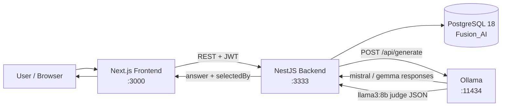
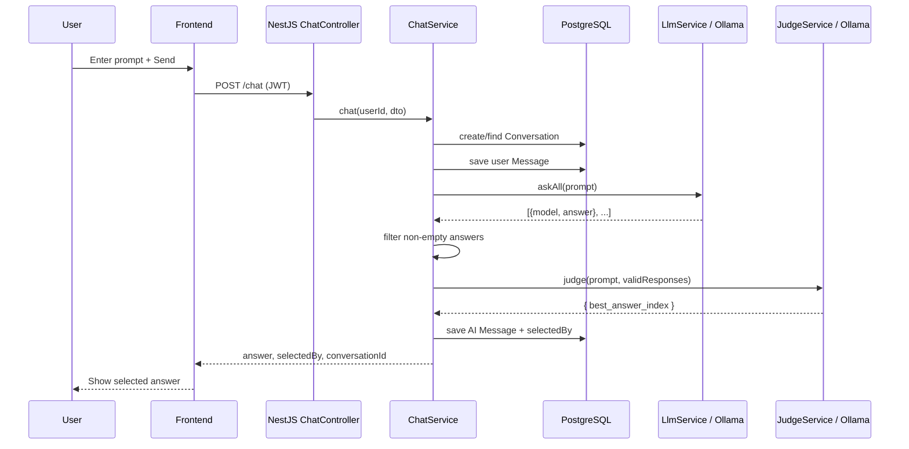
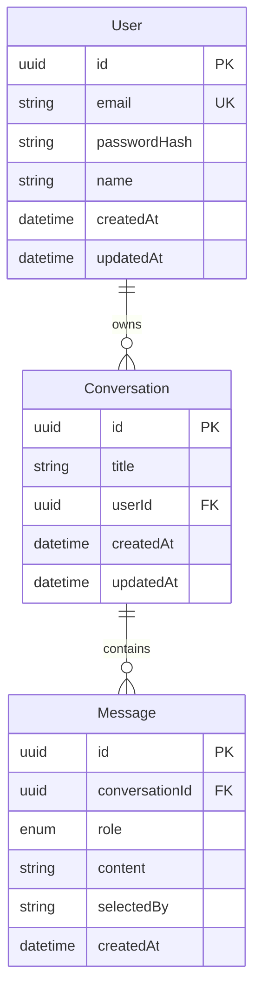
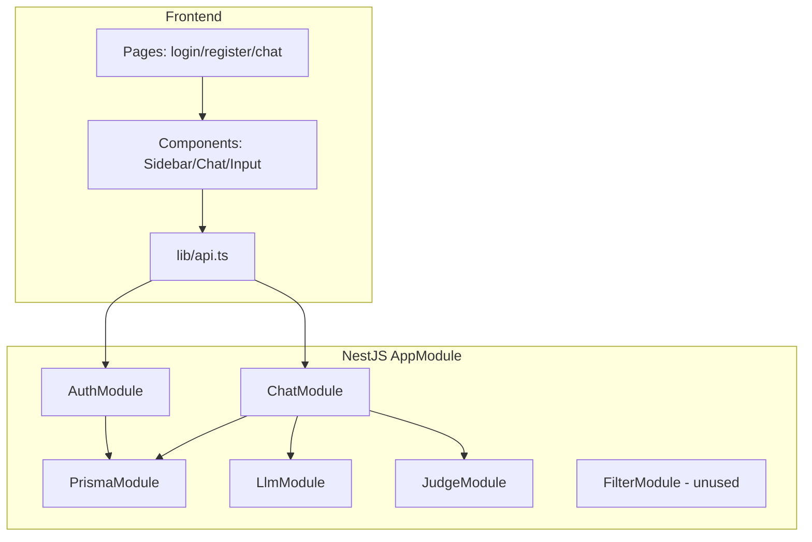
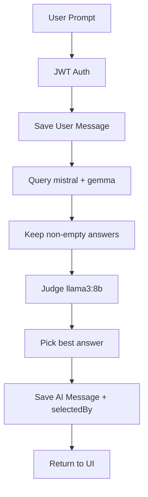

# Fusion AI — Project Documentation for PPT and Detailed Report

> **Purpose of this document:** Single source of truth for preparing a college project presentation (PPT) and a detailed project report (PDF).  
> **Source of truth:** The Fusion-AI repository in this workspace (`web-client/`, `api-server/`, `docker-compose.yml`, root `README.md`, `.gitignore`).  
> **Accuracy rule:** Confirmed facts are labeled as such. Inferred problem/need language is labeled. Unverified items are listed under Missing Information. Secrets and real credentials are excluded.  
> **Doc update note:** Updated after JWT auth + Prisma chat persistence, PostgreSQL **18** Docker setup (`Fusion_AI` database), root/web-client `.gitignore` policy (track `.env.example`, ignore real `.env`), and related README/env example changes.

---

# 1. Project Fact Sheet

| Field | Confirmed Value |
|--------|------------------|
| **Project Name** | Fusion AI |
| **Project Type** | Full-stack web application (client–server) |
| **Project Domain** | Artificial Intelligence / Conversational AI / Multi-LLM chat systems |
| **One-line Description** | A Multi-LLM chatbot that queries multiple local language models, uses an AI judge to select the best answer, and stores per-user conversations. |
| **Main Purpose** | Deliver higher-quality chat answers by comparing multiple LLM outputs and selecting the best one via a judge model. |
| **Target Users** | End users who register/login and chat; intended for personal/local demonstration use (college project / prototype). |
| **Frontend Technology** | Next.js 16 (App Router), React 19, TypeScript, Tailwind CSS v4, Lucide React |
| **Backend Technology** | NestJS 11, TypeScript, Axios, Passport JWT, bcrypt, class-validator |
| **Database** | PostgreSQL 18 (Docker `postgres:18-alpine`), database `Fusion_AI`, Prisma ORM 7 |
| **Programming Languages** | TypeScript (primary), SQL (Prisma migrations) |
| **Frameworks** | Next.js, NestJS, Prisma |
| **Major Libraries** | Axios, Passport JWT, bcrypt, class-validator, class-transformer, Lucide React, `@prisma/adapter-pg`, `pg` |
| **Cloud / Infrastructure** | Local Docker Compose for PostgreSQL 18 only (root `.env` supplies `POSTGRES_*`). Production cloud hosting: **Not confirmed**. |
| **APIs / Integrations** | Ollama local HTTP API (`/api/generate`); REST API between frontend and backend |
| **Authentication / Security** | JWT Bearer tokens, bcrypt password hashing, CORS, DTO validation, conversation ownership checks |
| **Analytics / Monitoring** | **Not confirmed** (no analytics SDK found) |
| **AI / ML Technologies** | Local LLMs via Ollama: responder models `mistral`, `gemma`; judge model `llama3:8b` |
| **Deployment / Hosting** | Local development confirmed (`localhost:3000` frontend, `localhost:3333` backend). Production deployment: **Not confirmed**. |
| **Main Modules** | Auth, Chat (multi-LLM + judge), Conversations, Prisma/Data, LLM, Judge; Filter exists but is unused in active pipeline |
| **Main Features** | Register/login, JWT sessions, multi-LLM chat, AI judge selection, conversation history, clear chats, show winning model name |

---

# 2. Executive Summary

**PPT Version:**  
Fusion AI is a Multi-LLM chatbot. One user prompt is sent to multiple local models (Mistral, Gemma). An AI judge (Llama 3 8B) picks the best answer. Users authenticate with JWT, and chats are saved in PostgreSQL.

**Report Version:**  
Fusion AI is a full-stack conversational AI system with a clear separation between a Next.js frontend and a NestJS backend. Its distinguishing idea is **ensemble-style answer selection**: instead of trusting a single model, the backend queries multiple Ollama-hosted LLMs in parallel, filters empty responses, and asks a dedicated judge model to return the best answer index in JSON. Authenticated users get per-user conversation history persisted in PostgreSQL through Prisma. The current repository is a working local prototype, with Dockerized **PostgreSQL 18** (database name `Fusion_AI`), tracked `.env.example` templates, a root `.gitignore` that excludes real secrets, and documented Ollama model setup. Several UI elements (Upgrade to Pro, thumbs, regenerate, search) are present visually but are not wired to backend behavior.

---

# 3. Project Introduction

## Short Introduction (≈100–150 words — PPT-ready)

Fusion AI is a modern Multi-LLM chatbot designed to improve answer quality by combining multiple language models. When a user asks a question, the backend queries local models such as Mistral and Gemma through Ollama, then uses a judge model (Llama 3 8B) to select the most factually reliable response. The system includes user registration and login with JWT authentication, and stores conversations and messages in PostgreSQL so users can continue previous chats. The frontend is built with Next.js and Tailwind CSS, while the backend uses NestJS and Prisma. Fusion AI demonstrates how AI decision-making can be applied to compare model outputs and present a single selected answer to the user.

## Detailed Introduction (≈400–700 words — Report-ready)

Large Language Models (LLMs) have become central to conversational applications, yet a single model can still produce incomplete, inconsistent, or hallucinated answers. Different models often excel in different areas; one may be stronger on reasoning while another is clearer in explanation. This creates a practical need for systems that do not rely on a single opaque response, but can **compare** candidate answers and choose a stronger one.

Fusion AI addresses this need by implementing a Multi-LLM chat pipeline with an AI judge. The user interacts through a web chat interface. After authentication, a prompt is sent to the NestJS backend. The LLM service queries configured Ollama models (`mistral` and `gemma`) in parallel. Empty or invalid responses are discarded. Remaining answers are passed to a judge service that prompts `llama3:8b` to return a JSON object containing `best_answer_index`. The selected answer and the winning model name are returned to the client and stored as conversation messages.

Beyond the AI pipeline, Fusion AI includes standard application concerns required for a usable product prototype: user accounts (email/password with bcrypt hashing), JWT-based protected APIs, conversation listing and retrieval, and cascade-safe relational storage of users, conversations, and messages. Local infrastructure is documented clearly: **PostgreSQL 18** via Docker Compose (database `Fusion_AI`), Ollama for local model inference, frontend on port 3000, and backend on port 3333.

From an academic perspective, the project is significant because it combines several contemporary software engineering themes—full-stack TypeScript, modular NestJS services, ORM-based persistence, REST APIs, and local LLM orchestration—into one coherent system. From a user perspective, the value is a chat experience that can surface not only an answer, but also which model produced the selected response (`selectedBy` / “via {model}” in the UI).

**Interpretation note (problem/need):** The repository does not contain a formal business requirements document. The problem framing above is inferred from confirmed functionality (multi-LLM querying + judge selection + authenticated chat storage) and the root README’s description of the pipeline.

---

# 4. Abstract

## Short Project Summary (PPT)

Fusion AI queries multiple local LLMs for each prompt, uses an AI judge to pick the best answer, and stores authenticated users’ chat history in PostgreSQL.

## Detailed Project Summary

Fusion AI is a client–server Multi-LLM chatbot. The Next.js frontend provides login, register, and chat UI. The NestJS backend exposes JWT-protected REST endpoints for authentication, chatting, and conversation management. Chat requests trigger a pipeline: parallel Ollama generation → response validation → judge selection → persistence of user and AI messages. PostgreSQL stores users, conversations, and messages. The system is designed for local development and demonstration.

## Academic Abstract (≈250–400 words)

Single-model chatbots may produce uneven answer quality because each Large Language Model has different strengths and failure modes. Fusion AI is a full-stack Multi-LLM conversational system that addresses this limitation by generating multiple candidate answers and selecting the best one through an AI judge.

The system consists of a Next.js (App Router) frontend and a NestJS backend, both written in TypeScript. Users register and log in using email and password; passwords are hashed with bcrypt, and authenticated sessions use JWT Bearer tokens stored in the browser. Chat and conversation APIs are protected by a JWT guard. When a user sends a message, the backend creates or reuses a conversation, stores the user message, queries multiple Ollama models (`mistral`, `gemma`) concurrently via HTTP, filters empty answers, and asks a judge model (`llama3:8b`) to return a JSON index of the best response. The selected answer and the originating model name are saved and returned to the UI.

Data persistence is implemented with Prisma and PostgreSQL 18 (`Fusion_AI`). The schema includes User, Conversation, and Message entities with cascade deletes and indexes for efficient listing and message retrieval. Local PostgreSQL is provided through Docker Compose with environment-driven `POSTGRES_*` settings. The application does not currently show confirmed production cloud deployment, analytics, payment systems, or background job queues. Automated tests present in the backend appear to be NestJS starter leftovers and are not aligned with the current Auth/Chat architecture.

Overall, Fusion AI demonstrates a practical architecture for Multi-LLM response fusion, secure per-user chat history, and modular service design suitable for academic presentation and further enhancement.

---

# 5. Problem Statement

## Formal Problem Statement

**Existing challenge:** Conversational AI systems that rely on a single LLM may return answers that are incomplete, inconsistent, or factually weak. Different models may answer the same question differently, and an end user typically has no built-in way to compare those answers automatically.

**Why it matters:** In educational, technical, and general Q&A settings, answer reliability affects trust and usefulness. Hallucinations and incorrect technical claims reduce the practical value of chatbots.

**Limitations being addressed (interpreted from implemented design):**
- Dependence on one model’s output
- Lack of automated comparison between candidate answers
- Lack of personal chat persistence without authentication and storage

**How this project attempts to solve it:**  
Fusion AI queries multiple local LLMs for each user prompt, filters invalid/empty responses, uses an AI judge model to select the best answer based on factual correctness and hallucination penalties (as encoded in the judge prompt), and presents the selected answer together with the winning model identity. Authenticated users can retain conversation history in PostgreSQL.

> **Label:** The formal “business problem” text is an interpretation grounded in confirmed features. No separate requirements PDF was found in the repository.

---

# 6. Objectives

### Primary Objective
Build a Multi-LLM chatbot that selects the best answer using an AI judge and presents it to authenticated users through a modern web interface.

### Secondary Objectives
- Provide user registration and login with secure password storage and JWT access.
- Persist conversations and messages per user.
- Allow users to create new chats, reopen past chats, and clear conversation history.
- Display which model was selected as the winning responder.

### Technical Objectives
- Implement a NestJS modular backend with Auth, Chat, LLM, Judge, and Prisma layers.
- Integrate Ollama for local LLM inference.
- Use Prisma + PostgreSQL for relational persistence.
- Expose validated REST APIs protected by JWT.
- Build a Next.js chat UI with Tailwind CSS.

### User / Business Objectives
- Give users a simple chat experience similar to common AI assistants.
- Improve perceived answer quality through multi-model comparison (design intent).
- Keep the system runnable locally for demonstration and academic evaluation.

> Objectives above match implemented/confirmed functionality. UI-only controls (Upgrade, regenerate, like/dislike, search) are **not** treated as objectives of completed features.

---

# 7. Scope

## In Scope (Confirmed Current Implementation)

- User registration and login
- JWT-authenticated chat API
- Multi-LLM parallel querying via Ollama (`mistral`, `gemma`)
- AI judge selection via `llama3:8b`
- Conversation create/list/get/clear-all
- Backend endpoint to delete a single conversation (API exists)
- Message persistence with optional `selectedBy` model name
- Local PostgreSQL 18 via Docker Compose (`Fusion_AI`)
- Tracked `.env.example` templates; real env files gitignored
- CORS configuration for frontend origin
- Request DTO validation (class-validator)

## Outside Current Scope / Not Confirmed

- Production cloud hosting / CI/CD pipelines
- Streaming token responses
- Payment / “Upgrade to Pro” functionality
- Working regenerate / feedback / copy / search features in UI
- Admin panel / roles beyond authenticated user
- Mobile native apps
- Analytics dashboards
- Email verification / password reset
- Cloud LLM providers (OpenAI, Anthropic, etc.) — not used; local Ollama only

## Future Scope (Suggestions Only)
See Section 27. These are **not** existing features.

---

# 8. Target Users and Use Cases

## Target Users

| User Type | Confirmed? | Description |
|-----------|------------|-------------|
| Registered end user | Yes | Can register, login, chat, manage own conversations |
| Administrator | No | No admin role/module found |
| Guest (unauthenticated chat) | No | Chat APIs require JWT; UI redirects to login |

## High-Level Use Cases (Summary)

1. Register a new account  
2. Log in and receive JWT  
3. Start a new chat and send a prompt  
4. Receive judged Multi-LLM answer with winning model shown  
5. Continue an existing conversation  
6. List previous conversations from sidebar  
7. Clear all conversations  
8. Log out  

Detailed end-to-end use cases are in Section 20.

---

# 9. Tools and Technologies

## Programming Languages

| Technology | What it is | Where used | Why useful | Dependent features |
|------------|------------|------------|------------|--------------------|
| TypeScript | Typed JS supersets | Frontend + backend | Safer APIs and UI code | Entire application |
| SQL | Relational DDL | Prisma migration | Creates DB schema | Auth + chat persistence |

## Frontend

| Technology | What it is | Where used | Why useful | Dependent features |
|------------|------------|------------|------------|--------------------|
| Next.js 16 | React meta-framework (App Router) | `web-client/` | Routing, SSR/CSR app structure | Pages: `/`, `/login`, `/register` |
| React 19 | UI library | Components + pages | Component UI | Chat UI |
| Tailwind CSS v4 | Utility CSS | `globals.css`, components | Rapid styling | Layout/visual design |
| Lucide React | Icon set | `MessageBubble.tsx` | Lightweight icons | Feedback/regenerate UI icons |
| Geist fonts | Google fonts via `next/font` | `layout.tsx` | Typography | Overall UI look |
| React Compiler | Babel plugin / Next config | `next.config.ts` | Optimized React compilation | Frontend build |
| localStorage | Browser storage | `lib/api.ts` | Persist JWT/user client-side | Auth session |

**State management:** React `useState` / `useEffect` only. No Redux/Zustand found.  
**Forms:** Native HTML forms on login/register. No Formik/React Hook Form.  
**Charts:** None found.

## Backend

| Technology | What it is | Where used | Why useful | Dependent features |
|------------|------------|------------|------------|--------------------|
| NestJS 11 | Node.js backend framework | `api-server/src` | Modular controllers/services | Auth, Chat APIs |
| Node.js / Express (via Nest platform) | Runtime / HTTP adapter | Nest default | Host REST API | All APIs |
| Axios | HTTP client | `llm.service.ts`, `judge.service.ts` | Call Ollama | Multi-LLM + judge |
| class-validator / class-transformer | DTO validation | Auth/Chat DTOs + ValidationPipe | Input safety | Register/login/chat payloads |
| ConfigModule | Nest config | Global | Env-based config | PORT, JWT, DB, CORS |

## Database

| Technology | What it is | Where used | Why useful | Dependent features |
|------------|------------|------------|------------|--------------------|
| PostgreSQL 18 | Relational DB | Docker Compose (`postgres:18-alpine`) | Durable structured storage | Users, chats, messages |
| Database `Fusion_AI` | App database name | Created via `POSTGRES_DB` | Isolates project data | All Prisma models |
| Prisma 7 | ORM | schema, `prisma.config.ts`, PrismaService | Type-safe DB access; URL in config (not in schema) | All persistence |
| `@prisma/adapter-pg` + `pg` | Driver adapter | `prisma.service.ts` | Prisma 7 PostgreSQL connectivity | DB connection |

## Cloud / Infrastructure

| Technology | Status |
|------------|--------|
| Docker Compose | Confirmed for local Postgres 18; volume mount `/var/lib/postgresql` (PG18 requirement) |
| Root `.env` for Compose | Confirmed pattern: `POSTGRES_USER`, `POSTGRES_PASSWORD`, `POSTGRES_DB` |
| Object storage / CDN / Lambda / queues | **Not confirmed** |
| Kubernetes / Terraform | **Not confirmed** |

## Authentication and Security

| Technology | Where used |
|------------|------------|
| `@nestjs/jwt` + Passport JWT | Token issue/validate |
| bcrypt | Password hashing (cost factor 10) |
| JwtAuthGuard | Protect chat/conversation/`/auth/me` |
| CORS | Restrict origin to `FRONTEND_URL` |
| ValidationPipe whitelist/forbidNonWhitelisted | Reject unexpected fields |

## AI / ML / LLM

| Technology | Role |
|------------|------|
| Ollama | Local LLM runtime (`http://localhost:11434/api/generate`) |
| mistral | Responder model |
| gemma | Responder model |
| llama3:8b | Judge model selecting best answer index |

## Analytics / Monitoring
**Not confirmed.**

## Testing Tools

| Tool | Evidence | Actual usefulness in this project |
|------|----------|-----------------------------------|
| Jest + Supertest | `package.json`, `*.spec.ts`, `test/` | Scaffold present; current tests target obsolete Nest hello-world style endpoints and do **not** validate Auth/Chat/LLM |

## Development Tools

- ESLint (frontend + backend)
- Prettier (backend)
- Nest CLI / Next CLI
- Prisma Migrate / Studio scripts
- Yarn (backend recommended), NPM (frontend README)

## Version Control
Git (repository present). Root `.gitignore` plus `web-client/.gitignore` and `api-server/.gitignore` ignore real `.env` files while allowing `.env.example` to be committed.

## Deployment / Hosting
Local only confirmed. Nest README mentions Mau deployment generically; **not project-specific deployment evidence**.

## Third-Party Services and APIs

| Service | Purpose | Communication |
|---------|---------|---------------|
| Ollama | Local LLM generation + judging | Backend Axios POST to `/api/generate` |

No payment, email, cloud AI, or analytics providers confirmed.

---

# 10. System Architecture

## Architecture Style (Confirmed)

- **Client–server**
- **Frontend/backend separation**
- **Modular monolith** (NestJS modules inside one backend process)
- **REST API** (JSON over HTTP)
- **Database layer** (Prisma → PostgreSQL)
- **External local AI runtime** (Ollama)

**Not confirmed:** GraphQL, microservices, serverless functions, event-driven queues, cloud object storage, background workers.

## High-Level Architecture Explanation

**PPT Version:**  
Browser UI → NestJS API → (PostgreSQL + Ollama models). Chat path: many LLMs answer → judge picks best → save & return.

**Report Version:**  
The system is a three-tier local architecture. The presentation tier is a Next.js SPA-style client (client components for auth/chat). The application tier is NestJS, organized into Auth and Chat modules, with supporting LLM and Judge services. The data tier is PostgreSQL. AI inference is treated as an external dependency running on the same machine via Ollama. Authentication is stateless JWT. Conversation ownership is enforced in service logic.

## Component-by-Component Architecture

1. **Frontend (Next.js)** — pages, chat components, API client (`lib/api.ts`)  
2. **Auth Module** — register/login/me, JWT strategy  
3. **Chat Module** — chat + conversations controller/services  
4. **LLM Service** — parallel Ollama calls  
5. **Judge Service** — judge prompt + JSON parse  
6. **Prisma Module** — DB client lifecycle  
7. **PostgreSQL** — persistent store  
8. **Ollama** — model runtime  
9. **Filter Service/Module** — present in code, **not imported/used** by active `AppModule`/`ChatModule` pipeline  
10. **AppController** — legacy/demo GET chat controller file exists but is **not registered** in current `AppModule`

## Request / Data Flow (Chat)

User types message → Frontend `sendChat` POST `/chat` with Bearer token → JwtAuthGuard → ChatService resolves conversation → save user message → LlmService.askAll → filter non-empty → JudgeService.judge → save AI message (`selectedBy`) → return `{ conversationId, answer, selectedBy }` → UI updates messages + sidebar list.

## Mermaid Architecture Diagram



---

# 11. Project Workflow

## Workflow A — Register / Login

| Step | Detail |
|------|--------|
| Trigger | User submits register or login form |
| Frontend | `register/page.tsx` or `login/page.tsx` calls API |
| API | `POST /auth/register` or `POST /auth/login` |
| Backend | Validate DTO → hash/compare password → sign JWT |
| Database | Create user (register) or read user (login) |
| Output | Store `accessToken` + user in localStorage; redirect to `/` |

## Workflow B — Multi-LLM Chat (Primary)

| Step | Detail |
|------|--------|
| Trigger | User sends message from InputArea |
| Frontend | Optimistic user bubble; `POST /chat` |
| Backend | Auth → conversation resolve → store user msg → askAll → judge → store AI msg |
| External | Ollama generate for responders + judge |
| Output | AI bubble with text + optional “via {model}”; sidebar refresh |

## Workflow C — Open Existing Conversation

| Step | Detail |
|------|--------|
| Trigger | Sidebar conversation click |
| API | `GET /conversations/:id` |
| Backend | Ownership check; return messages ordered by createdAt |
| Output | ChatArea populated with history |

## Workflow D — Clear All Conversations

| Step | Detail |
|------|--------|
| Trigger | “Clear All” |
| API | `DELETE /conversations` |
| Backend | `deleteMany` for user |
| Output | Empty sidebar + empty chat |

## Mermaid Sequence Diagram — Chat Pipeline



---

# 12. Project Modules

## Module 1: Authentication (`api-server/src/auth`, `web-client` login/register)

- **Purpose:** Account creation, login, identity for protected APIs  
- **Responsibilities:** Register, login, `/auth/me`, JWT issue/validate  
- **Key actions:** Create account, sign in, logout (client clears storage)  
- **Data:** User (email, passwordHash, name)  
- **Connections:** Required by Chat module via JwtAuthGuard  

## Module 2: Chat Orchestration (`api-server/src/chat`)

- **Purpose:** Run Multi-LLM + judge pipeline and persist messages  
- **Responsibilities:** Conversation resolve, chat execution, response shaping  
- **Frontend:** Main page send flow  
- **APIs:** `POST /chat`  
- **Connections:** Uses LLM + Judge + Prisma  

## Module 3: Conversations Management

- **Purpose:** List/load/delete chat threads  
- **Services:** `ConversationsService`  
- **Frontend:** Sidebar list, select, clear all  
- **Note:** Single-conversation delete API exists; frontend delete-one UI **not confirmed**  

## Module 4: LLM Service (`api-server/src/llm`)

- **Purpose:** Query responder models in parallel  
- **Models:** `mistral`, `gemma` (deepseek commented out)  
- **Failure handling:** Returns `{ answer: null, error }` on failure  

## Module 5: Judge Service (`api-server/src/judge`)

- **Purpose:** Choose best answer index via `llama3:8b`  
- **Output parsing:** `safeJsonParse` extracts JSON; defaults to index 0 on failure  

## Module 6: Data Access (`api-server/src/prisma` + `prisma/`)

- **Purpose:** Database connectivity and schema  
- **Entities:** User, Conversation, Message  

## Module 7: Frontend Chat UI

- **Components:** Sidebar, ChatArea, InputArea, MessageBubble, UpgradeTab  
- **Pages:** `/`, `/login`, `/register`  

## Module 8: Filter (Present but Inactive in Current App Wiring)

- **Files:** `filter.service.ts`, `filter.module.ts`  
- **Status:** Implements richer filtering (short answers / refusal phrases), but **ChatService does not call FilterService**, and FilterModule is not imported by AppModule/ChatModule.  
- **Evidence class:** Configuration/code present; usage in active pipeline **not confirmed**.

---

# 13. Detailed Features

## Core Features

### Multi-LLM Response Generation
- **What:** Sends one prompt to multiple Ollama models concurrently  
- **Why useful:** Diversifies candidate answers  
- **Who:** Authenticated users  
- **How:** `LlmService.askAll` + `Promise.all`  
- **Evidence:** `api-server/src/llm/llm.service.ts`, `chat.service.ts`  
- **Best for screenshots/diagrams:** Architecture + chat with “via mistral/gemma”

### AI Judge Selection
- **What:** Judge model returns best answer index as JSON  
- **Why useful:** Automates selection using factuality/hallucination rules in prompt  
- **Evidence:** `api-server/src/judge/judge.service.ts`  
- **Best for:** Workflow/sequence diagrams, viva explanation

### Winning Model Display
- **What:** UI shows `via {selectedBy}` on AI messages  
- **Evidence:** `MessageBubble.tsx`, message `selectedBy` field  

## User / Account Features

### Register / Login / Logout
- Confirmed end-to-end  
- Evidence: auth controller/service + login/register pages + `setSession`/`clearSession`

### Session Persistence (Client)
- JWT + user JSON in localStorage keys `fusion_access_token`, `fusion_user`  
- Home page redirects to `/login` if no token  

## Data Management Features

### Conversation History
- List, open, auto-title from first prompt (truncate >40 chars)  
- Clear all conversations  

### Message Persistence
- Roles: `user` | `ai`  
- Cascade delete with conversation/user  

## Communication / Engagement Features

### Chat Interface
- Welcome empty state, floating input, loading spinner  

### UI-only Controls (Not Backend-Connected)
- Upgrade to Pro tab  
- Thumbs up/down, Copy, Regenerate buttons (no handlers)  
- Sidebar search button (no handler)  
- **Label these carefully in PPT/report as UI placeholders, not completed features.**

## Analytics Features
None confirmed.

## Automation Features
Parallel multi-model querying and automated judge selection (pipeline automation). No job queues.

## AI Features
Local Multi-LLM generation + judge decision-making.

## Administrative Features
None confirmed.

## Integration Features
Ollama HTTP integration.

## Security Features
JWT guards, bcrypt, validation pipe, CORS, ownership checks (`ForbiddenException`).

### Screenshot Priority Features
1. Login  
2. Register  
3. Empty chat welcome  
4. Active chat with answer + “via model”  
5. Sidebar conversation list  
6. Loading state while models respond  
7. (Optional) Note UI placeholders separately  

---

# 14. Frontend

## Framework and Structure

- Next.js App Router under `web-client/src/app`
- Client components for interactive pages (`'use client'`)
- API helper: `web-client/src/lib/api.ts`

## Routing / Pages

| Route | File | Role |
|-------|------|------|
| `/` | `app/page.tsx` | Main chat (auth-gated) |
| `/login` | `app/login/page.tsx` | Sign in |
| `/register` | `app/register/page.tsx` | Sign up |

## Major Components

- `Sidebar.tsx` — brand, new chat, conversation list, clear all, logout, user chip  
- `ChatArea.tsx` — message list + welcome  
- `InputArea.tsx` — prompt input + send  
- `MessageBubble.tsx` — message rendering + action icons  
- `UpgradeTab.tsx` — decorative upgrade strip  

## Styling / Design

- Tailwind v4 (`@import "tailwindcss"`)
- Cream background `#FEFBEB`, indigo accent `#6366F1`
- Rounded sidebar / pill input aesthetic  

## State Management

Local React state on chat page: messages, input, loading, conversations, activeConversationId, user.

## API Communication

`fetch` wrappers with optional Bearer token; base URL `NEXT_PUBLIC_API_URL` or `http://localhost:3333`.

## Auth Handling

Token presence check; unauthorized responses clear session and redirect.

## Responsive Design

Some `md:` padding classes; sidebar is fixed width (`w-70`). Dedicated mobile drawer: **not confirmed**.

## Notable Frontend Libraries

Next, React, Tailwind, Lucide, Geist fonts.

## Contribution to System

Frontend is the exclusive user-facing layer for auth and chat; it does not run LLMs itself.

---

# 15. Backend

## Framework / Runtime

NestJS 11 on Node.js, default listen port 3333 (`PORT` env override).

## Architecture

Modular Nest app:

```text
AppModule
 ├── ConfigModule (global)
 ├── PrismaModule
 ├── AuthModule
 └── ChatModule
      ├── LlmModule
      └── JudgeModule
```

## Controllers / Routes (Active)

| Method | Path | Guard | Handler |
|--------|------|-------|---------|
| POST | `/auth/register` | No | AuthController |
| POST | `/auth/login` | No | AuthController |
| GET | `/auth/me` | JWT | AuthController |
| POST | `/chat` | JWT | ChatController |
| GET | `/conversations` | JWT | ChatController |
| GET | `/conversations/:id` | JWT | ChatController |
| DELETE | `/conversations` | JWT | ChatController |
| DELETE | `/conversations/:id` | JWT | ChatController |

## Business Logic Highlights

- Email normalized to lowercase  
- Conversation access denied if `userId` mismatch  
- Chat pipeline preserves Multi-LLM + judge behavior while adding persistence  
- Judge JSON parse is defensive (`safeJsonParse`)  

## Validation

Global ValidationPipe: whitelist, forbid non-whitelisted, transform.

## Database Access

PrismaService extends generated PrismaClient with PrismaPg adapter and `DATABASE_URL`.

## File Handling / Background Jobs

None confirmed.

## Error Handling

Nest HTTP exceptions (`Conflict`, `Unauthorized`, `NotFound`, `Forbidden`); chat returns fallback text if no LLM responds.

## Legacy / Unused Code Notes (Important for accuracy)

- `app.controller.ts` contains a GET `/chat` Multi-LLM demo path but is **not** registered in `AppModule`.  
- `FilterService` exists but is unused by the active chat pipeline.  
- Unit/e2e tests still expect hello-world behavior and are outdated relative to current modules.

---

# 16. Database and Data Model

## Technology

PostgreSQL **18** + Prisma schema (`api-server/prisma/schema.prisma`) + migration `20260722191842_init_auth_and_chats`, database **`Fusion_AI`**. Connection URL is supplied through `api-server/prisma.config.ts` + `DATABASE_URL`.

## Entities

### User
- `id` UUID PK  
- `email` unique  
- `passwordHash`  
- `name` optional  
- timestamps  
- has many Conversations  

### Conversation
- `id` UUID PK  
- `title`  
- `userId` FK → User (cascade delete)  
- timestamps  
- index `(userId, updatedAt)`  
- has many Messages  

### Message
- `id` UUID PK  
- `conversationId` FK → Conversation (cascade delete)  
- `role` enum `user | ai`  
- `content`  
- `selectedBy` optional (winning model name)  
- `createdAt`  
- index `(conversationId, createdAt)`  

## Data Lifecycle

- **Create:** register user; create conversation on first message; create messages on each turn  
- **Read:** list conversations; get conversation+messages; `/auth/me`  
- **Update:** conversation `updatedAt` touched after messages; user `updatedAt` via Prisma  
- **Delete:** clear all conversations; delete one conversation (API); cascade removes messages  

## Mermaid ER Diagram



---

# 17. APIs

## API Group: Authentication

- **Purpose:** Account and token issuance  
- **Operations:** register, login, me  
- **Triggered by:** Register/Login pages; `fetchMe` exists in client but is not used by pages currently  
- **Data affected:** User table; JWT claims `sub`, `email`

## API Group: Chat

- **Purpose:** Run Multi-LLM + judge and persist turn  
- **Important endpoint:** `POST /chat` body `{ message, conversationId? }`  
- **Returns:** `{ conversationId, prompt, answer, selectedBy }` (or error fields if no LLM)  
- **Data affected:** Conversation + Message  

## API Group: Conversations

- **Purpose:** History management  
- **Operations:** list, get one, clear all, delete one  
- **Frontend currently uses:** list, get, clear all  
- **Delete one:** backend confirmed; frontend call **not confirmed**

---

# 18. Authentication and Security

## Confirmed Mechanisms

| Mechanism | Evidence |
|-----------|----------|
| Email/password registration | `AuthService.register` |
| bcrypt hash (salt rounds 10) | `bcrypt.hash(dto.password, 10)` |
| JWT access tokens | `@nestjs/jwt`, Passport JWT strategy |
| Bearer token extraction | `ExtractJwt.fromAuthHeaderAsBearerToken()` |
| JWT expiry config | `JWT_EXPIRES_IN` default `7d` |
| Protected routes | `JwtAuthGuard` on chat/conversations/`me` |
| Conversation ownership checks | Forbidden/NotFound in chat/conversations services |
| Input validation | DTOs + ValidationPipe |
| CORS origin restriction | `FRONTEND_URL` |
| Secrets via environment | `.env.example` documents keys (`DATABASE_URL`, `JWT_*`, `POSTGRES_*`, etc.); real `.env` / `.env.local` are gitignored |

## Not Confirmed

- Refresh tokens  
- Role-based access control (admin/user roles)  
- Email verification / 2FA  
- Rate limiting  
- Encryption at rest beyond DB defaults  
- Secure cookie sessions (uses localStorage instead)  
- HTTPS enforcement in app code  

## Secret Handling Note

Do **not** commit real `.env` / `.env.local` values. Commit only `.env.example` templates. In reports and PPT slides, list **variable names** and setup steps — do not paste live passwords or JWT secrets. If a local sample password appears in `.env.example` for demo convenience, treat it as a local-dev placeholder, not a production secret.

---

# 19. Third-Party Integrations

## Ollama (Confirmed)

- **Purpose:** Local LLM inference for responders and judge  
- **Data/functionality:** Text completions via `/api/generate` with `stream: false`  
- **Communication:** Axios POST from Nest services to `http://localhost:11434/api/generate`  
- **Dependent features:** Multi-LLM answers, judge selection  
- **Required models (README):** `llama3:8b`, `mistral`, `gemma`

No other external SaaS integrations confirmed.

---

# 20. Important End-to-End Use Cases

### Use Case 1: User Registration
- **Actor:** New user  
- **Goal:** Create account and enter app  
- **Preconditions:** Backend + DB running  
- **Steps:** Open `/register` → enter name/email/password → submit  
- **System:** Validate → hash password → create user → JWT  
- **Result:** Redirect to chat home authenticated  

### Use Case 2: User Login
- **Actor:** Existing user  
- **Goal:** Access chats  
- **Preconditions:** Registered account  
- **Steps:** `/login` → credentials → submit  
- **System:** Verify bcrypt → JWT  
- **Result:** Session stored; chat page loads conversations  

### Use Case 3: Ask a New Question (New Conversation)
- **Actor:** Logged-in user  
- **Goal:** Get judged Multi-LLM answer  
- **Preconditions:** Ollama models available  
- **Steps:** Type prompt → send  
- **System:** Create conversation titled from prompt → save user msg → multi-LLM → judge → save AI msg  
- **Result:** Answer shown with optional model badge; sidebar gains conversation  

### Use Case 4: Continue Existing Conversation
- **Actor:** Logged-in user  
- **Goal:** Follow-up in same thread  
- **Preconditions:** `activeConversationId` set  
- **Steps:** Send another message  
- **System:** Reuse conversation ID; append messages; ownership validated  
- **Result:** Thread grows; `updatedAt` refreshed  

### Use Case 5: Reopen Past Chat
- **Actor:** Logged-in user  
- **Goal:** View history  
- **Steps:** Click sidebar item  
- **System:** `GET /conversations/:id`  
- **Result:** Messages restored in ChatArea  

### Use Case 6: Clear Chat History
- **Actor:** Logged-in user  
- **Goal:** Remove all conversations  
- **Steps:** Click Clear All  
- **System:** `DELETE /conversations`  
- **Result:** Empty history and blank chat  

### Use Case 7: Logout
- **Actor:** Logged-in user  
- **Goal:** End local session  
- **Steps:** Log out  
- **System:** Clear localStorage; redirect `/login`  
- **Result:** Protected page inaccessible without re-login  

### Use Case 8: Unauthorized Access Attempt
- **Actor:** User with expired/invalid token  
- **Goal:** (System) protect APIs  
- **Steps:** Call protected endpoint / load home  
- **System:** Guard rejects; frontend may redirect on unauthorized  
- **Result:** User returned to login  

### Use Case 9: No LLM Available (Failure Path)
- **Actor:** Logged-in user  
- **Goal:** Ask question while Ollama down/models missing  
- **System:** Valid responses empty → store/return “No LLM responded”  
- **Result:** Error-style AI message in UI  

### Use Case 10: Judge Returns Invalid JSON (Resilience Path)
- **Actor:** System internal  
- **Goal:** Still return an answer  
- **System:** `safeJsonParse` fallback to index 0  
- **Result:** First valid response used  

---

# 21. Implementation Details

## 1) Parallel Multi-LLM Querying
1. **Problem:** Need multiple candidate answers quickly  
2. **Approach:** Map models to Axios calls; `Promise.all`  
3. **Components:** `LlmService`  
4. **Flow:** prompt → N generate calls → array of `{model, answer}`  
5. **Result:** Aggregated candidates for judging  

## 2) AI Judge Decision
1. **Problem:** Choose best among candidates  
2. **Approach:** Structured judge prompt requiring JSON `{ best_answer_index }`  
3. **Components:** `JudgeService`, Ollama `llama3:8b`  
4. **Flow:** Build prompt → generate → parse JSON safely  
5. **Result:** Selected index / fallback 0  

## 3) Authenticated Conversation Persistence
1. **Problem:** Keep chats per user  
2. **Approach:** JWT identity + Prisma relations  
3. **Components:** Auth + Chat + Conversations + Prisma  
4. **Flow:** Resolve conversation → write messages → touch updatedAt  
5. **Result:** Sidebar history and reloadable threads  

## 4) Client Session Handling
1. **Problem:** Keep user logged in across reloads  
2. **Approach:** localStorage token + user snapshot  
3. **Components:** `lib/api.ts`, chat page gate  
4. **Result:** Simple SPA auth UX (no httpOnly cookies)  

## 5) Defensive Response Filtering (Active vs Unused)
- **Active:** ChatService filters empty/non-string answers only  
- **Unused richer filter:** `FilterService` (short/refusal filtering) exists but is not wired  

---

# 22. Testing and Quality

## Automated Testing

- Jest configured in backend `package.json`  
- Files: `app.controller.spec.ts`, `test/app.e2e-spec.ts`  
- **Assessment:** Tests appear to be Nest starter leftovers expecting `Hello World` / `GET /`, which do **not** match current `AppModule` (no AppController registered).  
- **Conclusion:** Meaningful automated coverage for Auth/Chat/LLM is **absent or outdated**.

## Other Quality Practices Found

- TypeScript throughout  
- ESLint configs (frontend + backend)  
- Prettier scripts (backend)  
- Prisma schema + migrations  
- DTO validation  
- Modular Nest organization  

## CI/CD
**Not confirmed** (no `.github/workflows` found).

---

# 23. Deployment

## Confirmed Local Environment

| Component | How to run | Port / Notes |
|-----------|------------|--------------|
| PostgreSQL 18 | From repo root: create root `.env` with `POSTGRES_*`, then `docker compose up -d` | `localhost:5432`; image `postgres:18-alpine`; DB `Fusion_AI`; user typically `postgres`; volume `fusion_ai_pg18_data` mounted at `/var/lib/postgresql` (required for PG 18+) |
| Backend | `cp .env.example .env` → `yarn install` → `npx prisma migrate dev` (or `migrate deploy`) → `yarn start:dev` in `api-server/` | 3333; `DATABASE_URL` must match Compose DB; special characters in passwords must be **URL-encoded** (e.g. `@` → `%40`) |
| Frontend | `cp .env.example .env.local` (optional) → `npm run dev` in `web-client/` | 3000; `NEXT_PUBLIC_API_URL` defaults to `http://localhost:3333` |
| Ollama | Local install + model pulls | 11434 |

## Why the database is named `Fusion_AI`
The intended product name is “Fusion AI”. A space in the PostgreSQL database name complicates connection URLs and tooling, so the implemented name is **`Fusion_AI`** (underscore). Documented in `docker-compose.yml` and README.

## Prisma 7 connection configuration
- `schema.prisma` declares `provider = "postgresql"` only (no `url` in schema).  
- Connection URL comes from `DATABASE_URL` via `api-server/prisma.config.ts`.  
- Runtime client uses `@prisma/adapter-pg` in `PrismaService`.

## Environment Variable Names (from `.env.example` files)

**Backend (`api-server/.env.example`):**  
`DATABASE_URL`, `JWT_SECRET`, `JWT_EXPIRES_IN`, `PORT`, `FRONTEND_URL`, plus Compose-related keys `POSTGRES_USER`, `POSTGRES_PASSWORD`, `POSTGRES_DB` (also used when documenting root Compose `.env`).

**Frontend (`web-client/.env.example`):**  
`NEXT_PUBLIC_API_URL`

**Root Compose `.env` (local, gitignored):**  
`POSTGRES_USER`, `POSTGRES_PASSWORD`, `POSTGRES_DB` — required for `docker compose` variable substitution.

## Git ignore policy (confirmed)
- Root `.gitignore` and package-level gitignores exclude real env files (`.env`, `.env.local`, etc.).  
- **`.env.example` files are intentionally tracked** so teammates can copy templates.  
- Prisma generated client under `api-server/src/generated/` is ignored.  
- Local agent skill folders (`.agents`, `.claude`, `.windsurf`, `.cursor`) are ignored.

## Production Hosting
**Not confirmed from available project files.**

---

# 24. Challenges and Solutions

> Label: Technical challenges inferred from implementation complexity (not from personal diaries/commit narratives beyond early prototype history).

### Challenge 1: Selecting among conflicting LLM answers
- **Why difficult:** Models disagree; need automated decision  
- **Solution:** Judge model with strict JSON contract  
- **Tech:** Ollama + JudgeService + safe parse  
- **Result:** Deterministic selection path with fallback  

### Challenge 2: Unreliable LLM JSON output
- **Why difficult:** Models may add prose around JSON  
- **Solution:** Extract substring between first `{` and last `}`; default index 0  
- **Result:** Pipeline continues even on malformed judge output  

### Challenge 3: Partial model failures
- **Why difficult:** One model may timeout/fail  
- **Solution:** Per-model try/catch returning null answer; filter empties; handle zero-valid case  
- **Result:** Degraded but controlled behavior  

### Challenge 4: Securing multi-user chat data
- **Why difficult:** Conversations must not leak across users  
- **Solution:** JWT identity + ownership checks on get/delete/continue  
- **Result:** Forbidden/NotFound on mismatch  

### Challenge 5: Keeping local AI stack operable
- **Why difficult:** Depends on Docker Postgres + Ollama models being present  
- **Solution:** Documented setup in README (compose + model pulls + `.env.example`)  
- **Result:** Reproducible local demo path  

### Challenge 6: PostgreSQL 18 Docker data directory change
- **Why difficult:** Postgres 18 Docker images expect the volume at `/var/lib/postgresql` (not the older `/var/lib/postgresql/data` layout); upgrading image with the old mount causes container restart loops  
- **Solution / Approach used:** Compose volume remapped to `/var/lib/postgresql` with a PG18-specific volume name; fresh volume for major-version upgrade  
- **Technologies involved:** Docker Compose, `postgres:18-alpine`  
- **Result:** Stable local Postgres 18 with database `Fusion_AI`  
- **Label:** Technical challenge inferred from implementation complexity / Docker image requirements.
---

# 25. Benefits and Impact

## User Benefits
- Single chat UX with potentially stronger selected answers  
- Visibility into which model won (`via {model}`)  
- Saved conversation history after login  

## Technical Benefits
- Clear module boundaries (Auth/Chat/LLM/Judge/Prisma)  
- Type-safe stack (TypeScript + Prisma)  
- Local LLM usage (no cloud AI vendor required for core path)  

## Productivity / Academic Benefits
- Demonstrates full-stack + AI integration suitable for viva and report  
- Pipeline is easy to explain diagrammatically  

## Scalability Benefits
Only limited evidence: parallel model calls and DB indexes. Broad production scalability claims are **not supported**.

## Maintainability
Modular Nest services and Prisma migrations support iterative evolution.

---

# 26. Limitations

### Confirmed Limitations
- Local Ollama dependency; offline/models-missing causes chat failure path  
- Only two active responder models in code (`mistral`, `gemma`)  
- No streaming responses  
- UI placeholders not functional (upgrade/regenerate/feedback/search)  
- Single-conversation delete API unused by frontend  
- `FilterService` richer filtering not used in active chat path  
- Client token storage in localStorage (XSS risk classically higher than httpOnly cookies)  
- Tests outdated relative to current architecture  
- No confirmed production deployment/monitoring  
- Major Postgres Docker version upgrades require volume/layout awareness (PG 18 mount path differs from older images)  

### Potential Technical Limitations
- Judge adds latency (extra LLM call)  
- Parallel multi-model calls increase compute/time cost  
- No conversation context window management beyond storing messages (prompt to LLMs is current user message only in `ChatService` — prior messages are saved but **not** confirmed as being sent back into `askAll`)  
- No rate limiting under abuse scenarios  

---

# 27. Future Enhancements

> **FUTURE SUGGESTIONS ONLY — not existing features.**

1. Wire `FilterService` into chat pipeline for refusal/short-answer filtering  
2. Send conversation history context to LLMs (multi-turn awareness)  
3. Stream tokens to UI for better UX  
4. Implement regenerate / copy / feedback actions  
5. Add per-conversation delete in sidebar  
6. Expand model set / make models configurable via env  
7. Add refresh tokens + httpOnly cookies  
8. Add automated API/e2e tests for auth and chat pipeline  
9. Deploy frontend/backend to cloud with managed Postgres  
10. Optional cloud LLM providers as fallback when local models fail  
11. Accessibility and true mobile navigation drawer  
12. Admin analytics for model win rates (`selectedBy` aggregation)

---

# 28. Project Structure

```text
Fusion-AI/
├── README.md                          # System overview & setup
├── .gitignore                         # Root ignore: secrets, builds, generated, agent caches
├── .env                               # Root Compose secrets (gitignored; create locally)
├── docker-compose.yml                 # PostgreSQL 18 (Fusion_AI)
├── PROJECT_DOCUMENTATION_FOR_PPT_AND_REPORT.md
├── web-client/                          # Next.js UI
│   ├── package.json
│   ├── .env.example                   # NEXT_PUBLIC_API_URL (tracked)
│   ├── .env.local                     # Local overrides (gitignored)
│   ├── next.config.ts
│   ├── public/                        # Static assets (default Next SVGs)
│   └── src/
│       ├── app/                       # Routes: /, /login, /register
│       ├── components/                # Sidebar, Chat/*, UI/UpgradeTab
│       └── lib/api.ts                 # REST client + session helpers
└── api-server/                           # NestJS API
    ├── package.json
    ├── .env.example                   # DATABASE_URL, JWT_*, POSTGRES_* templates (tracked)
    ├── .env                           # Local secrets (gitignored)
    ├── prisma/
    │   ├── schema.prisma              # User, Conversation, Message (no URL in schema)
    │   └── migrations/                # init_auth_and_chats
    ├── prisma.config.ts               # Prisma 7 DATABASE_URL wiring
    ├── test/                          # Outdated e2e scaffold
    └── src/
        ├── main.ts                    # Bootstrap, CORS, ValidationPipe
        ├── app.module.ts              # Active module graph
        ├── auth/                      # Auth module
        ├── chat/                      # Chat + conversations
        ├── llm/                       # Multi-model querying
        ├── judge/                     # Judge selection
        ├── filter/                    # Present, unused in active wiring
        ├── prisma/                    # PrismaService
        └── generated/prisma/          # Generated client (gitignored build artifact)
```

**Intentionally omitted from academic structure dumps:** `node_modules`, build outputs, agent skill caches under `.agents`/`.claude`/`.windsurf` (tooling aids, not product modules).  
**Note:** Root `.env` and `api-server/.env` / `web-client/.env.local` must not appear in submissions; only `.env.example` templates.
---

# 29. Screenshot Plan

| Screenshot No. | Feature/Page | What Screenshot Should Show | Why Important | PPT/Report/Both | Likely Capture Location |
|---:|---|---|---|---|---|
| 1 | Login | Email/password form, Fusion branding colors | Auth entry | Both | `/login` |
| 2 | Register | Name/email/password form | Account creation | Both | `/register` |
| 3 | Chat empty state | Welcome to FUSION message | First UX impression | Both | `/` with no messages |
| 4 | Sidebar + New Chat | Brand + New chat button + empty list | Navigation module | Both | `/` |
| 5 | Sending message loading | Spinner on send button | Async AI wait | Report | `/` during request |
| 6 | AI answer with model | Message + `via mistral` or `via gemma` | Core Multi-LLM value | Both | `/` after response |
| 7 | Conversation list filled | Multiple titles in sidebar | Persistence | Both | `/` after several chats |
| 8 | Reopened conversation | Historical messages loaded | History feature | Report | Select sidebar item |
| 9 | Clear All result | Empty conversations state | Data management | Report | After Clear All |
| 10 | Logout / redirected login | Back on login page | Session end | Report | After logout |
| 11 | Architecture diagram render | FE/BE/DB/Ollama | System design | Both | Diagram (not UI) |
| 12 | ER diagram | User–Conversation–Message | Data design | Report | Diagram |
| 13 | Sequence diagram | Chat pipeline | Workflow viva aid | Both | Diagram |
| 14 | Prisma schema excerpt | Models shown as figure | Implementation evidence | Report | schema screenshot |
| 15 | Docker Compose running | `fusion-ai-postgres` on `postgres:18-alpine`, DB `Fusion_AI` | Infra setup | Report | Docker Desktop/terminal |
| 16 | Ollama models list | mistral/gemma/llama3 pulled | AI dependency | Report | Terminal `ollama list` |
| 17 | API tools (optional) | Postman/Insomnia `/chat` with JWT | Backend proof | Report | API client |
| 18 | UI placeholders callout | Upgrade tab / regenerate icons | Honesty about unfinished UI | Report | `/` annotations |
| 19 | Error: No LLM | AI bubble error text | Failure handling | Report | Stop Ollama and chat |
| 20 | Home loading gate | “Loading...” auth bootstrap | Auth gate UX | Optional | Brief on `/` refresh |

---

# 30. Diagram Plan + Mermaid Diagrams

| Diagram | What it should show | Evidence enough? | PPT/Report/Both |
|---------|---------------------|------------------|-----------------|
| System Architecture | User–FE–BE–DB–Ollama | Yes | Both |
| Chat Sequence | Auth chat pipeline | Yes | Both |
| ER Diagram | 3 entities + relations | Yes | Report (PPT optional simplified) |
| Module Diagram | Nest modules | Yes | Report |
| Data Flow | Prompt → answers → judge → UI | Yes | Both |
| Deployment Diagram | Local docker + processes | Partial (local only) | Report |
| Use Case Diagram | Actors/use cases | Inferred from features | Report |

## Module Diagram (Mermaid)



## Simplified Data Flow (Mermaid)



---

# 31. PPT Content Plan (≈18 slides)

### Slide 1 — Title
- **Purpose:** Introduce project  
- **Points:** Fusion AI; Multi-LLM Chatbot with AI Judge; [STUDENT NAME]; [COLLEGE NAME]; [ACADEMIC YEAR]  
- **Visual:** Project logo/title on cream/indigo theme screenshot  
- **Notes:** State it is a full-stack local AI system  

### Slide 2 — Project Overview
- Multi-LLM chat application  
- Frontend Next.js + Backend NestJS  
- PostgreSQL persistence  
- Ollama local models  
- JWT authentication  
- **Visual:** Architecture thumbnail  

### Slide 3 — Introduction
- LLMs are powerful but unequal  
- Single-model answers can be weak  
- Fusion AI compares multiple answers  
- Judge selects best response  
- Users keep chat history  

### Slide 4 — Problem Statement
- Single-model dependency  
- Hallucination / inconsistency risk  
- No automatic comparison for end users  
- Need personal secure chat history  
- Project provides judged Multi-LLM pipeline  

### Slide 5 — Purpose / Need
- Improve answer selection quality  
- Demonstrate AI decision-making  
- Provide practical chat product prototype  
- Academic demonstration of full-stack + AI  

### Slide 6 — Objectives
- Primary: Multi-LLM + judge chatbot  
- Auth with JWT/bcrypt  
- Store conversations  
- Show winning model  
- Modular maintainable architecture  

### Slide 7 — Tools & Technologies
- Next.js, React, Tailwind  
- NestJS, Prisma, PostgreSQL **18** (`Fusion_AI`)  
- JWT, bcrypt, Axios  
- Ollama: mistral, gemma, llama3:8b  
- Docker Compose + `.env.example` templates
### Slide 8 — System Architecture
- Client–server modular monolith  
- REST APIs  
- DB + Ollama external dependency  
- **Visual:** Architecture Mermaid/exported diagram  

### Slide 9 — Project Workflow
- Prompt → parallel LLMs → filter → judge → save → UI  
- **Visual:** Sequence diagram  

### Slide 10 — Main Modules
- Auth, Chat, Conversations, LLM, Judge, Prisma, Frontend UI  
- Mention Filter exists but unused  

### Slide 11 — Core Features
- Register/Login  
- Multi-LLM answering  
- AI judge selection  
- History sidebar  
- Model attribution (`via ...`)  

### Slide 12 — Important Feature Deep Dive (Judge)
- Judge prompt criteria  
- JSON `best_answer_index`  
- Safe parse fallback  
- Selected answer returned  

### Slide 13 — Database Overview
- User / Conversation / Message  
- Cascade deletes  
- `selectedBy` field  
- **Visual:** ER diagram  

### Slide 14 — Screenshots / Demo
- Login, chat answer, sidebar history  
- 3–4 strongest screenshots  

### Slide 15 — Challenges & Solutions
- Conflicting answers → judge  
- Bad JSON → safe parse  
- Model failures → filter/fallback  
- Data isolation → ownership checks  

### Slide 16 — Benefits / Outcomes
- Better selection pipeline  
- Full-stack learning outcome  
- Local AI without cloud vendor lock-in for core path  
- Persistent personalized chats  

### Slide 17 — Future Scope
- Context-aware multi-turn prompting  
- Streaming UI  
- Wire filter + feedback actions  
- Tests + cloud deploy  
- Model win-rate analytics  

### Slide 18 — Conclusion + Thank You
- Fusion AI demonstrates Multi-LLM judged chat  
- Working local prototype with auth + DB  
- Thank you / Q&A  
- Placeholders for guide names  

---

# 32. Detailed Report Content Plan (≈35–60 pages target)

## Preliminary Pages
1. Cover Page — title, student, college, year placeholders  
2. Certificate — college template  
3. Declaration — originality statement  
4. Internship/Company certificate — only if applicable; else omit  
5. Acknowledgement — template in Section 33  
6. Abstract — use academic abstract above  
7. Personal/Project details table  
8. TOC / LOF / LOT  

| Chapter | Purpose | Key Content from This Project | Screenshots/Diagrams | Approx. Length |
|---------|---------|-------------------------------|----------------------|----------------|
| 1 Introduction | Context & problem | Intro, need, objectives, scope | None or overview fig | 4–6 pp |
| 2 Technology Background | Domain concepts | LLM, Multi-LLM, judging, REST, JWT, ORM | Concept figures | 3–5 pp |
| 3 Tools & Technologies | Stack justification | Section 9 details | Tech logos table | 4–6 pp |
| 4 Requirements Analysis | FR/NFR/use cases | Sections 8, 20, 33 | Use case diagram | 4–6 pp |
| 5 Architecture & Design | System design | Sections 10–12, 16–17 | Arch, ER, sequence, modules | 6–8 pp |
| 6 Modules & Features | Feature depth | Sections 12–13 | UI screenshots | 5–7 pp |
| 7 Implementation & Working | How built | Frontend/backend/workflows | Code-structure figs (no secrets) | 6–8 pp |
| 8 Security & Data Handling | Security chapter | Section 18 | Auth flow diagram | 3–4 pp |
| 9 Testing & Validation | Quality | Section 22 honesty about limited tests | Test command screenshots if any | 2–3 pp |
| 10 Results / Demo | Evidence | Screenshot plan 1–10, 15–16 | Captioned figures | 5–8 pp |
| 11 Challenges | Engineering issues | Section 24 | Optional | 2–3 pp |
| 12 Benefits, Limitations, Future | Evaluation | Sections 25–27 | None | 3–4 pp |
| 13 Conclusion | Close | Section 33 conclusion | None | 1–2 pp |
| References | Citations | Nest/Next/Prisma/Ollama docs + README | — | 1–2 pp |
| Appendices | Optional | API table, env var names, setup commands | — | 2–4 pp |

---

# 33. Report Draft Sections

### Acknowledgement Template

I would like to express my sincere gratitude to **[INTERNAL GUIDE]** for continuous guidance and valuable suggestions during the development of this project. I also thank **[EXTERNAL GUIDE / COMPANY MENTOR if any]** and the faculty of **[COLLEGE NAME]** for their support. I am thankful to my family and friends for their encouragement throughout **[ACADEMIC YEAR]**.  

Any institutional or company names not verified from the repository remain placeholders.

### Abstract
See Section 4 Academic Abstract.

### Problem Statement
See Section 5.

### Objectives
See Section 6.

### Scope
See Section 7.

### Functional Requirements (derived from implementation)

1. The system shall allow users to register with email, password (min length 6), and optional name.  
2. The system shall authenticate users and issue JWT access tokens.  
3. The system shall reject unauthenticated chat/conversation requests.  
4. The system shall accept a chat message and optional conversation ID.  
5. The system shall query multiple configured LLMs for each prompt.  
6. The system shall filter empty responses before judging.  
7. The system shall use a judge model to select the best answer index.  
8. The system shall store user and AI messages in the database.  
9. The system shall return the selected answer and winning model identifier.  
10. The system shall list, retrieve, and clear conversations for the owning user.  
11. The system shall prevent access to another user’s conversations.  

### Non-Functional Requirements (interpreted from design choices; not a formal SRS file)

1. Usability: simple chat UI similar to common assistants.  
2. Security: hashed passwords, JWT protection, input validation, CORS.  
3. Maintainability: modular NestJS services and typed TypeScript codebase.  
4. Portability for demo: local Docker Postgres + local Ollama.  
5. Reliability behaviors: fallback when judge JSON invalid; explicit error when no LLM responds.  
6. Performance targets (SLA): **Not confirmed** numerically.

### Conclusion

Fusion AI successfully implements a local Multi-LLM chatbot with AI judge selection, JWT-authenticated users, and PostgreSQL-backed conversation history. The project demonstrates how multiple model outputs can be aggregated and evaluated to present a single selected answer through a modern full-stack architecture. While some UI elements remain placeholders and production deployment is not confirmed, the core pipeline—authentication, multi-model querying, judging, and persistence—is implemented and suitable for academic demonstration and further enhancement.

### Future Scope
See Section 27.

### References / Sources to Include

1. Project root `README.md` (system description and setup)  
2. NestJS Documentation — https://docs.nestjs.com  
3. Next.js Documentation — https://nextjs.org/docs  
4. Prisma Documentation — https://www.prisma.io/docs  
5. Ollama Documentation — https://ollama.com / local API docs  
6. PostgreSQL Documentation  
7. Passport JWT / bcrypt conceptual references  
8. Tailwind CSS documentation  
9. Repository source files listed in Evidence map (Section 36)

Do not invent papers/statistics that are not used by the project.

---

# 34. Viva Questions and Answers

1. **What is Fusion AI?**  
   A Multi-LLM chatbot that queries multiple local models and uses an AI judge to select the best answer, with JWT auth and PostgreSQL chat history.

2. **What problem does it solve?**  
   Over-reliance on a single LLM’s answer by comparing multiple candidates and selecting one.

3. **What is the tech stack?**  
   Next.js/React/Tailwind frontend; NestJS/Prisma/PostgreSQL backend; Ollama for LLMs.

4. **Why NestJS?**  
   Modular architecture for Auth, Chat, LLM, Judge services with guards and DI.

5. **Why Next.js?**  
   App Router pages for login/register/chat and modern React UI.

6. **Which models are used?**  
   Responders: `mistral`, `gemma`. Judge: `llama3:8b`.

7. **How does the judge work?**  
   Receives prompt + candidate answers; must return JSON `{ best_answer_index }`; parsed safely.

8. **What if judge returns invalid JSON?**  
   `safeJsonParse` falls back to index 0.

9. **How are passwords stored?**  
   bcrypt hashes (`passwordHash`), not plaintext.

10. **How does authentication work?**  
    Login/register returns JWT; client sends `Authorization: Bearer <token>`; Passport JWT validates.

11. **Where is the token stored?**  
    Browser localStorage (`fusion_access_token`).

12. **How is data isolated between users?**  
    Conversation queries check `userId`; mismatch → Forbidden.

13. **What tables exist?**  
    User, Conversation, Message (+ MessageRole enum).

14. **What does `selectedBy` mean?**  
    Name of the model whose answer was chosen.

15. **Is FilterService used?**  
    Implemented but not wired into the active ChatModule pipeline.

16. **Is AppController active?**  
    File exists with GET chat demo logic, but current AppModule does not register it; active chat is `POST /chat` in ChatController.

17. **Does the system use cloud LLMs?**  
    Not in code; uses local Ollama HTTP API.

18. **How are models called in parallel?**  
    `Promise.all` over Axios generate requests.

19. **What happens if all models fail?**  
    Returns/stores “No LLM responded”.

20. **Can guests chat?**  
    No; UI redirects to login; APIs are JWT-guarded.

21. **How is a conversation titled?**  
    From first prompt; truncated with `...` if longer than 40 characters.

22. **Which delete conversation APIs exist?**  
    Clear all and delete by id; frontend currently uses clear all.

23. **What port does backend use?**  
    3333 by default.

24. **What port does frontend use?**  
    3000 (Next dev).

25. **How is Postgres run?**  
    Docker Compose service `postgres` image `postgres:18-alpine`, database `Fusion_AI`, configured via root `.env` `POSTGRES_*` variables. Volume mounts at `/var/lib/postgresql` for PG 18 compatibility.

26. **What ORM is used?**  
    Prisma 7 with PostgreSQL adapter.

27. **Is there role-based admin access?**  
    Not confirmed / not implemented.

28. **Are regenerate/like buttons working?**  
    UI only; no handlers/API integration found.

29. **Is Upgrade to Pro real billing?**  
    No; decorative UI component only.

30. **Does chat send full history to the LLM?**  
    Current ChatService sends the latest prompt string to `askAll`; prior messages are stored but not confirmed as included in model prompts.

31. **How is CORS configured?**  
    Allows origin from `FRONTEND_URL` (default localhost:3000), methods GET/POST/DELETE/OPTIONS.

32. **What validation exists?**  
    class-validator DTOs + global ValidationPipe whitelist/forbidNonWhitelisted.

33. **What is the main API for chatting?**  
    `POST /chat` with `{ message, conversationId? }`.

34. **What does the chat response contain?**  
    `conversationId`, `prompt`, `answer`, `selectedBy` (and error fields if needed).

35. **Any analytics?**  
    Not confirmed.

36. **Any CI/CD?**  
    Not confirmed in repository.

37. **Are tests complete?**  
    Scaffold exists but appears outdated vs current architecture.

38. **What makes the project technically significant?**  
    End-to-end Multi-LLM orchestration with judge decisioning plus authenticated persistence.

39. **Limitations?**  
    Local dependency on Ollama, added latency from judging, unfinished UI actions, limited tests, no confirmed production deploy.

40. **Future improvements?**  
    Streaming, context windows, wire filter/feedback, stronger auth storage, cloud deploy, tests, analytics on model wins.

41. **Why PostgreSQL over a JSON file?**  
    Relational integrity, multi-user data, indexes, cascades for conversations/messages.

42. **How do frontend and backend communicate?**  
    REST JSON over HTTP via `fetch` in `lib/api.ts`.

43. **What package managers are used?**  
    Backend README recommends Yarn; frontend README uses NPM (either may work).

44. **Is GraphQL used?**  
    No; REST only.

45. **Microservices?**  
    No; modular monolith.

46. **How would you demo failure handling?**  
    Stop Ollama and send a chat; show “No LLM responded”.

47. **Security best-practice gap?**  
    localStorage JWT vs httpOnly cookies; no rate limiting confirmed.

48. **What is Ollama?**  
    Local runtime for pulling/running LLMs and exposing an HTTP generate API.

49. **Can models be changed?**  
    Yes, by editing model lists in `llm.service.ts` and judge model in `judge.service.ts` (as README notes).

50. **Is this production-ready?**  
    It is a working prototype for local demonstration; production hardening/deployment not confirmed.

51. **Why is the database called `Fusion_AI`?**  
    Product name is “Fusion AI”; spaces in DB names break connection URLs, so underscore form is used.

52. **Where is `DATABASE_URL` configured in Prisma 7?**  
    In `prisma.config.ts` (and `.env`), not inside `datasource` URL in `schema.prisma`.

53. **Which env files are committed?**  
    `.env.example` templates only. Real `.env` / `.env.local` / root Compose `.env` are gitignored.
---

# 35. Glossary

| Term | Meaning | Relation to this project |
|------|---------|--------------------------|
| LLM | Large Language Model | Generates candidate chat answers |
| Multi-LLM | Using multiple LLMs for one task | Core architecture of Fusion AI |
| Judge Model | LLM that evaluates other answers | `llama3:8b` selects best index |
| Ollama | Local LLM runner/API | Backend calls Ollama generate endpoint |
| JWT | JSON Web Token | Authenticates API requests |
| bcrypt | Password hashing algorithm | Stores `passwordHash` |
| Prisma | TypeScript ORM | Maps models to PostgreSQL |
| NestJS Module | Feature boundary in Nest | AuthModule, ChatModule, etc. |
| DTO | Data Transfer Object | Validates login/register/chat bodies |
| CORS | Cross-Origin Resource Sharing | Allows frontend origin to call API |
| Conversation | Chat thread entity | Sidebar list items |
| selectedBy | Winning model name field | Shown as “via {model}” |
| Cascade Delete | Child rows removed with parent | Messages deleted with conversation |
| App Router | Next.js routing system | `/`, `/login`, `/register` |
| Passport Strategy | Auth validation mechanism | JwtStrategy |
| ValidationPipe | Nest request validation layer | Global whitelist validation |
| Prototype | Early working version | Repo history indicates prototype origins |
| Fusion_AI | PostgreSQL database name | Underscore form of product name “Fusion AI” for URL-safe tooling |
| prisma.config.ts | Prisma 7 project config | Supplies `DATABASE_URL` (URL not in schema.prisma) |
| .env.example | Tracked env template | Documents required keys without committing personal `.env` |
| POSTGRES_* | Docker Compose DB env vars | `POSTGRES_USER`, `POSTGRES_PASSWORD`, `POSTGRES_DB` for container bootstrap |

---

# 36. Evidence / Source Map

| Claim | Evidence |
|-------|----------|
| Project name Fusion AI | Root README; frontend layout metadata; Sidebar title |
| Next.js 16 + React 19 | `web-client/package.json` |
| Tailwind v4 | `web-client/package.json`, `globals.css` |
| NestJS 11 backend | `api-server/package.json` |
| Prisma + PostgreSQL 18 | `schema.prisma`, `prisma.config.ts`, `docker-compose.yml` (`postgres:18-alpine`), PrismaService |
| Database name `Fusion_AI` | `POSTGRES_DB` / `DATABASE_URL` / README |
| Env templates tracked | `api-server/.env.example`, `web-client/.env.example`; real `.env` gitignored via root + package gitignores |
| JWT + bcrypt auth | `auth.module.ts`, `auth.service.ts`, `jwt.strategy.ts` |
| Chat pipeline Multi-LLM + judge | `chat.service.ts`, `llm.service.ts`, `judge.service.ts` |
| Models mistral/gemma/llama3:8b | llm/judge services + root README |
| REST API routes | `auth.controller.ts`, `chat.controller.ts`, root README table |
| Frontend session/API | `web-client/src/lib/api.ts` |
| Pages login/register/chat | `web-client/src/app/**` |
| UI placeholders | `UpgradeTab.tsx`; unhandled buttons in `MessageBubble.tsx` / Sidebar search |
| Filter unused | Filter module not imported by App/Chat modules; ChatService inline filter only |
| AppController not active | `app.module.ts` imports only Config/Prisma/Auth/Chat |
| Tests outdated | `app.controller.spec.ts`, `test/app.e2e-spec.ts` hello-world expectations |
| No CI workflows | No `.github` workflows found |
| Local-only infra confirmed | README setup + docker-compose PG18; no cloud deploy configs found |
| PG18 volume mount path | `docker-compose.yml` mounts `fusion_ai_pg18_data` → `/var/lib/postgresql` |

---

# 37. Missing Information / Placeholders / Requires Confirmation

## Academic / Personal Placeholders
- [STUDENT NAME]  
- [ENROLLMENT NUMBER]  
- [COLLEGE NAME]  
- [DEPARTMENT]  
- [INTERNAL GUIDE]  
- [EXTERNAL GUIDE]  
- [COMPANY NAME] (if internship)  
- [ACADEMIC YEAR]  
- [SUBMISSION DATE]  

## Not Confirmed from Project Files
- Production hosting URL / cloud provider  
- Real organizational client/customer  
- Formal SRS beyond implemented behavior  
- Quantitative performance benchmarks (latency/accuracy improvements)  
- Whether `FilterService` was planned for imminent wiring  
- Whether single-conversation delete UI was intentionally deferred  
- Whether conversation history will be included in future LLM prompts  
- Analytics/monitoring stack  
- Payment/subscription backend for “Upgrade to Pro”  
- Official branding assets beyond UI text  

## Previously outdated in this doc (now corrected)
- ~~PostgreSQL 16 / `fusion_ai` / user `fusion`~~ → **PostgreSQL 18**, database **`Fusion_AI`**, Compose user typically **`postgres`** via `POSTGRES_*`  
- ~~Schema URL only in older Prisma style~~ → Prisma 7 URL lives in **`prisma.config.ts`**  
- ~~No root `.gitignore`~~ → Root + package gitignores; **`.env.example` is committed**, real env files are not  

## Important Accuracy Reminders for PPT/Report
1. Do **not** claim cloud LLM APIs unless added later.  
2. Do **not** present Upgrade/Regenerate/Feedback/Search as completed features.  
3. Do **not** claim comprehensive automated test coverage.  
4. Do **not** invent accuracy percentage improvements without experiments.  
5. Clearly state local Ollama + **Docker PostgreSQL 18** (`Fusion_AI`) requirements.  
6. Never paste secrets from `.env` files into submissions; use `.env.example` key names only.  
7. Explain that `Fusion_AI` is the technical DB name for product name “Fusion AI”.  
8. If showing Docker screenshots, use PG 18 / current compose — not older PG 16 docs.
---

## Final Validation Checklist (Documentation Author)

- [x] Technologies listed are present in package manifests / code  
- [x] Features separated into confirmed vs UI-only vs unused code  
- [x] Frontend ↔ backend relationships verified via `api.ts` and controllers  
- [x] Database claims match Prisma schema/migration  
- [x] Ollama integration confirmed; other SaaS not invented  
- [x] Architecture diagrams match actual active modules  
- [x] Future enhancements labeled as suggestions  
- [x] Personal/college details left as placeholders  
- [x] Secrets excluded from report narrative (env **names** / encoding notes only; real passwords not documented here)  
- [x] PostgreSQL version/name/user and gitignore/env.example policy match current repo  
- [x] Enough material for ~15–20 PPT slides and a 35–60 page report plan  

---

*End of PROJECT_DOCUMENTATION_FOR_PPT_AND_REPORT.md*
)
